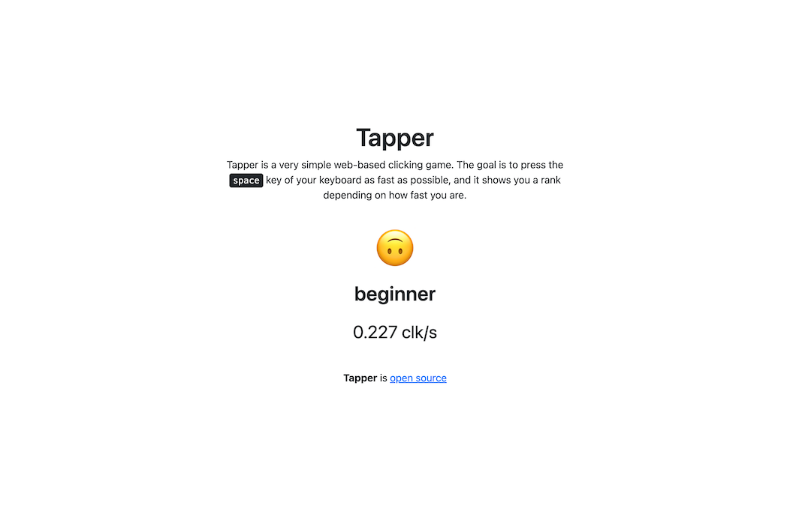

<h1 align="center">Tapper</h1>
<p align="center">A fast, web-based clicking game</p>

<br>

<p align="center">
    <a href="https://github.com/jarne/Tapper/blob/master/package.json">
        
    </a>
    <a href="https://app.netlify.com/sites/clever-dijkstra-9bf79e/deploys">
        
    </a>
    <a href="https://github.com/jarne/Tapper/blob/master/LICENSE">
        
    </a>
</p>

##

[• Description](#-description)  
[• Usage](#-usage)  
[• Contribution](#-contribution)  
[• License](#%EF%B8%8F-license)

## 📙 Description
Tapper is a very simple web-based clicking game, it's about to press the space key of your keyboard as fast as possible and it'll show you a rank depending on how fast you are.

Here's a screenshot of the page:



## 🖥 Usage
First, clone the repository using:

```
$ git clone https://github.com/jarne/Tapper.git
```

Then, install the dependencies using:

```
$ yarn install
```

Finally, run:

```
$ yarn build
```

The built website will be saved in the `public`-folder, just open the `index.html`-file in your browser.

## 🙋‍ Contribution
Contributions are always very welcome! It's completely equally if you're a beginner or a more experienced developer.

Thanks for your interest 🎉👍!

## 👨‍⚖️ License
[MIT](https://github.com/jarne/Tapper/blob/master/LICENSE)
